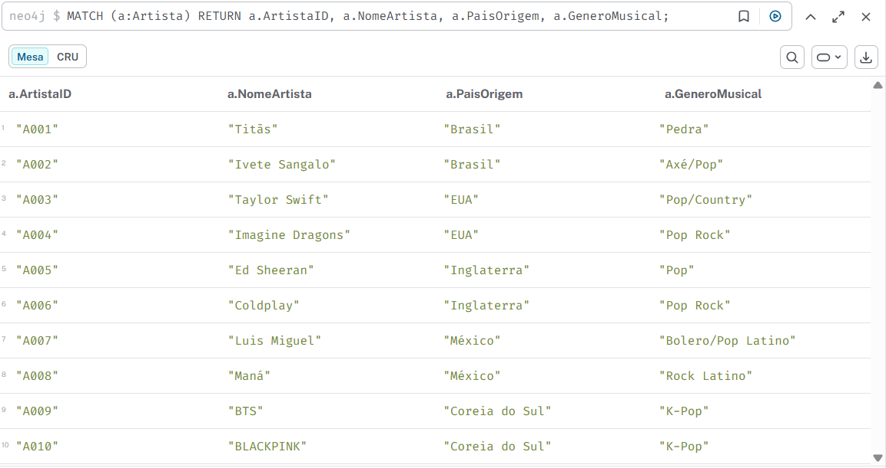
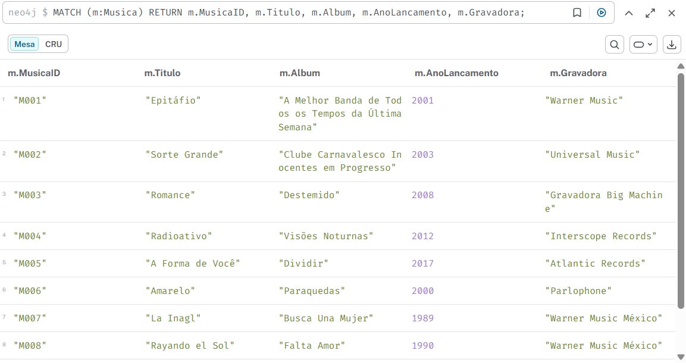
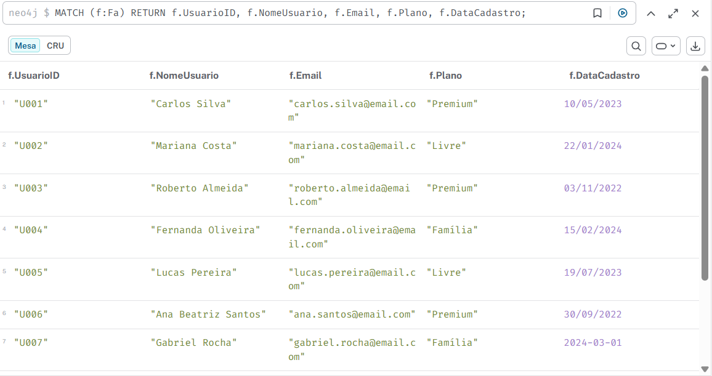
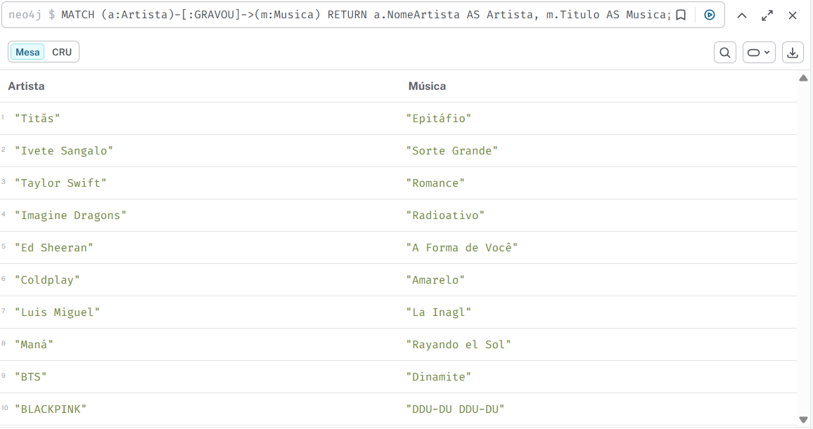
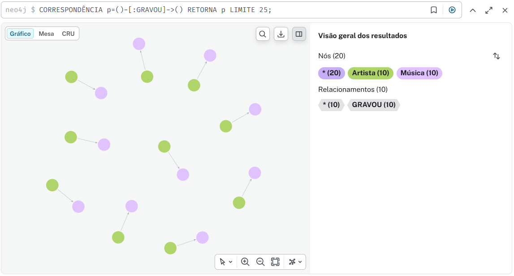

<p align="center">
  
</p>

<div align='center'>


<br/>

</div>

---

<p align="center" style="font-size: 25px; font-weight: bold; margin-top: 20px; margin-bottom: 20px;">
  🎧 Music Graph: Sistema de Recomendação com Neo4j & GDS
</p>

---

> ### 🎯 O Desafio:
Uma produtora de músivas me contratou para arquitetar e implementar um Sistema de Recomendação de Músicas de próxima geração.</br>
O objetivo central não é apenas armazenar dados, mas, revelar a "topologia do gosto musical" dos usuários.

Em vez de consultas SQL exaustivas em tabelas estáticas, utilizei o poder dos Grafos para mapear relacionamentos dinâmicos entre Usuários, Faixas, Artistas e Metadados Musicais (como bpm, danceability e valence).

> ### 🛠️ A Solução Técnica:
A implementação utiliza Neo4j e a linguagem Cypher para transformar dados brutos em uma rede de conhecimento (Knowledge Graph).</br>
A estratégia de recomendação foi dividida em duas frentes principais:

- <b> Filtragem Colaborativa (User Affinity)</b>:</br>
Identificação de "vizinhanças" de usuários com padrões de escuta similares para sugerir o que pessoas com gostos parecidos estão ouvindo.

- <b> Filtragem Baseada em Conteúdo (Content Similarity)</b>:</br>
Uso de métricas vetoriais para recomendar músicas que compartilham características técnicas intrínsecas, garantindo que a "vibe" da playlist se mantenha consistente.

> ### 🚀 Diferencial de Grafo:
O uso do motor de Graph Data Science (GDS) permite que o sistema vá além do básico, aplicando algoritmos como Node Similarity e Community Detection para agrupar nichos musicais de forma orgânica, oferecendo sugestões com baixa latência e alta precisão preditiva.

---

> ### 🚀 Resultado do meu projeto:

<b> 🎼 Nós e Atributos: </b>

<b> Artista: </b>
- ArtistaID (PK, alfanumérico único)
- NomeArtista
- AnosCarreira
- PaisOrigem
- GeneroMusical

<b> Música: </b>
- MusicaID (PK, alfanumérico único)
- Titulo
- Album
- Playlist
- AnoLancamento
- DuracaoMusica
- ISRC
- Gravadora

<b> Fã: </b>
- UsuarioID (PK, alfanumérico único)
- NomeUsuario
- Email
- Plano
- DataCadastro

<b> 🔗 Relacionamentos: </b>
- `(:Artista)-[:LANÇOU]->(:Album)`
- `(:Artista)-[:GRAVOU]->(:Musica)`
- `(:Fã)-[:OUVIU]->(:Musica)`
- `(:Fã)-[:SEGUE]->(:Artista)`
- `(:Fã)-[:CRIOU]->(:Playlist)`
- `(:Album)-[:CONTÉM]->(:Musica)`
- `(:Playlist)-[:CONTÉM]->(:Musica)`

---

> ### 🤔 Query utilizada:

<p align="center" style="font-size: 18px; font-weight: bold; margin-top: 20px; margin-bottom: 20px;">
  NÓ ARTISTA:
</p>

```
// Brasil
CREATE (:Artista {
  ArtistaID: "A001",
  NomeArtista: "Titãs",
  AnosCarreira: 40,
  PaisOrigem: "Brasil",
  GeneroMusical: "Rock"
});

CREATE (:Artista {
  ArtistaID: "A002",
  NomeArtista: "Ivete Sangalo",
  AnosCarreira: 30,
  PaisOrigem: "Brasil",
  GeneroMusical: "Axé/Pop"
});

// EUA
CREATE (:Artista {
  ArtistaID: "A003",
  NomeArtista: "Taylor Swift",
  AnosCarreira: 18,
  PaisOrigem: "EUA",
  GeneroMusical: "Pop/Country"
});

CREATE (:Artista {
  ArtistaID: "A004",
  NomeArtista: "Imagine Dragons",
  AnosCarreira: 15,
  PaisOrigem: "EUA",
  GeneroMusical: "Pop Rock"
});

// Inglaterra
CREATE (:Artista {
  ArtistaID: "A005",
  NomeArtista: "Ed Sheeran",
  AnosCarreira: 14,
  PaisOrigem: "Inglaterra",
  GeneroMusical: "Pop"
});

CREATE (:Artista {
  ArtistaID: "A006",
  NomeArtista: "Coldplay",
  AnosCarreira: 25,
  PaisOrigem: "Inglaterra",
  GeneroMusical: "Pop Rock"
});

// México
CREATE (:Artista {
  ArtistaID: "A007",
  NomeArtista: "Luis Miguel",
  AnosCarreira: 40,
  PaisOrigem: "México",
  GeneroMusical: "Bolero/Pop Latino"
});

CREATE (:Artista {
  ArtistaID: "A008",
  NomeArtista: "Maná",
  AnosCarreira: 35,
  PaisOrigem: "México",
  GeneroMusical: "Rock Latino"
});

// Coreia do Sul
CREATE (:Artista {
  ArtistaID: "A009",
  NomeArtista: "BTS",
  AnosCarreira: 11,
  PaisOrigem: "Coreia do Sul",
  GeneroMusical: "K-Pop"
});

CREATE (:Artista {
  ArtistaID: "A010",
  NomeArtista: "BLACKPINK",
  AnosCarreira: 10,
  PaisOrigem: "Coreia do Sul",
  GeneroMusical: "K-Pop"
});

```

<p align="center" style="font-size: 18px; font-weight: bold; margin-top: 20px; margin-bottom: 20px;">
  NÓ FÃ:
</p>

```
CREATE (:Fa {
  UsuarioID: "U001",
  NomeUsuario: "Carlos Silva",
  Email: "carlos.silva@email.com",
  Plano: "Premium",
  DataCadastro: date("2023-05-10")
});

CREATE (:Fa {
  UsuarioID: "U002",
  NomeUsuario: "Mariana Costa",
  Email: "mariana.costa@email.com",
  Plano: "Free",
  DataCadastro: date("2024-01-22")
});

CREATE (:Fa {
  UsuarioID: "U003",
  NomeUsuario: "Roberto Almeida",
  Email: "roberto.almeida@email.com",
  Plano: "Premium",
  DataCadastro: date("2022-11-03")
});

CREATE (:Fa {
  UsuarioID: "U004",
  NomeUsuario: "Fernanda Oliveira",
  Email: "fernanda.oliveira@email.com",
  Plano: "Family",
  DataCadastro: date("2024-02-15")
});

CREATE (:Fa {
  UsuarioID: "U005",
  NomeUsuario: "Lucas Pereira",
  Email: "lucas.pereira@email.com",
  Plano: "Free",
  DataCadastro: date("2023-07-19")
});

CREATE (:Fa {
  UsuarioID: "U006",
  NomeUsuario: "Ana Beatriz Santos",
  Email: "ana.santos@email.com",
  Plano: "Premium",
  DataCadastro: date("2022-09-30")
});

CREATE (:Fa {
  UsuarioID: "U007",
  NomeUsuario: "Gabriel Rocha",
  Email: "gabriel.rocha@email.com",
  Plano: "Family",
  DataCadastro: date("2024-03-01")
});

CREATE (:Fa {
  UsuarioID: "U008",
  NomeUsuario: "Patrícia Gomes",
  Email: "patricia.gomes@email.com",
  Plano: "Premium",
  DataCadastro: date("2023-12-12")
});

CREATE (:Fa {
  UsuarioID: "U009",
  NomeUsuario: "Ricardo Martins",
  Email: "ricardo.martins@email.com",
  Plano: "Free",
  DataCadastro: date("2023-04-25")
});

CREATE (:Fa {
  UsuarioID: "U010",
  NomeUsuario: "Juliana Ferreira",
  Email: "juliana.ferreira@email.com",
  Plano: "Premium",
  DataCadastro: date("2022-08-08")
});

```
<p align="center" style="font-size: 18px; font-weight: bold; margin-top: 20px; margin-bottom: 20px;">
  NÓ MÚSICA:
</p>

```
// Brasil
CREATE (:Musica {
  MusicaID: "M001",
  Titulo: "Epitáfio",
  Album: "A Melhor Banda de Todos os Tempos da Última Semana",
  Playlist: "Rock Brasil",
  AnoLancamento: 2001,
  DuracaoMusica: "4:00",
  ISRC: "BR-TIT-001",
  Gravadora: "Warner Music"
});

CREATE (:Musica {
  MusicaID: "M002",
  Titulo: "Sorte Grande",
  Album: "Clube Carnavalesco Inocentes em Progresso",
  Playlist: "Axé Hits",
  AnoLancamento: 2003,
  DuracaoMusica: "3:45",
  ISRC: "BR-IVE-002",
  Gravadora: "Universal Music"
});

// EUA
CREATE (:Musica {
  MusicaID: "M003",
  Titulo: "Love Story",
  Album: "Fearless",
  Playlist: "Pop Internacional",
  AnoLancamento: 2008,
  DuracaoMusica: "3:55",
  ISRC: "US-TS-003",
  Gravadora: "Big Machine Records"
});

CREATE (:Musica {
  MusicaID: "M004",
  Titulo: "Radioactive",
  Album: "Night Visions",
  Playlist: "Alternative Rock",
  AnoLancamento: 2012,
  DuracaoMusica: "3:06",
  ISRC: "US-ID-004",
  Gravadora: "Interscope Records"
});

// Inglaterra
CREATE (:Musica {
  MusicaID: "M005",
  Titulo: "Shape of You",
  Album: "Divide",
  Playlist: "Pop Hits",
  AnoLancamento: 2017,
  DuracaoMusica: "3:53",
  ISRC: "UK-ES-005",
  Gravadora: "Atlantic Records"
});

CREATE (:Musica {
  MusicaID: "M006",
  Titulo: "Yellow",
  Album: "Parachutes",
  Playlist: "Rock Internacional",
  AnoLancamento: 2000,
  DuracaoMusica: "4:29",
  ISRC: "UK-CP-006",
  Gravadora: "Parlophone"
});

// México
CREATE (:Musica {
  MusicaID: "M007",
  Titulo: "La Incondicional",
  Album: "Busca Una Mujer",
  Playlist: "Latino Classics",
  AnoLancamento: 1989,
  DuracaoMusica: "4:20",
  ISRC: "MX-LM-007",
  Gravadora: "Warner Music Mexico"
});

CREATE (:Musica {
  MusicaID: "M008",
  Titulo: "Rayando el Sol",
  Album: "Falta Amor",
  Playlist: "Rock Latino",
  AnoLancamento: 1990,
  DuracaoMusica: "4:30",
  ISRC: "MX-MA-008",
  Gravadora: "Warner Music Mexico"
});

// Coreia do Sul
CREATE (:Musica {
  MusicaID: "M009",
  Titulo: "Dynamite",
  Album: "BE",
  Playlist: "K-Pop Hits",
  AnoLancamento: 2020,
  DuracaoMusica: "3:19",
  ISRC: "KR-BTS-009",
  Gravadora: "BigHit Entertainment"
});

CREATE (:Musica {
  MusicaID: "M010",
  Titulo: "DDU-DU DDU-DU",
  Album: "Square Up",
  Playlist: "K-Pop Hits",
  AnoLancamento: 2018,
  DuracaoMusica: "3:29",
  ISRC: "KR-BP-010",
  Gravadora: "YG Entertainment"
});
```

---

<p align="center" style="font-size: 18px; font-weight: bold; margin-top: 20px; margin-bottom: 20px;">
  🔗 RELACIONAMENTO ARTISTA -> TÍTULO:
</p>

```
MATCH (a:Artista {NomeArtista: "Titãs"}), (m:Musica {Titulo: "Epitáfio"})
CREATE (a)-[:GRAVOU]->(m);

MATCH (a:Artista {NomeArtista: "Ivete Sangalo"}), (m:Musica {Titulo: "Sorte Grande"})
CREATE (a)-[:GRAVOU]->(m);

MATCH (a:Artista {NomeArtista: "Taylor Swift"}), (m:Musica {Titulo: "Love Story"})
CREATE (a)-[:GRAVOU]->(m);

MATCH (a:Artista {NomeArtista: "Imagine Dragons"}), (m:Musica {Titulo: "Radioactive"})
CREATE (a)-[:GRAVOU]->(m);

MATCH (a:Artista {NomeArtista: "Ed Sheeran"}), (m:Musica {Titulo: "Shape of You"})
CREATE (a)-[:GRAVOU]->(m);

MATCH (a:Artista {NomeArtista: "Coldplay"}), (m:Musica {Titulo: "Yellow"})
CREATE (a)-[:GRAVOU]->(m);

MATCH (a:Artista {NomeArtista: "Luis Miguel"}), (m:Musica {Titulo: "La Incondicional"})
CREATE (a)-[:GRAVOU]->(m);

MATCH (a:Artista {NomeArtista: "Maná"}), (m:Musica {Titulo: "Rayando el Sol"})
CREATE (a)-[:GRAVOU]->(m);

MATCH (a:Artista {NomeArtista: "BTS"}), (m:Musica {Titulo: "Dynamite"})
CREATE (a)-[:GRAVOU]->(m);

MATCH (a:Artista {NomeArtista: "BLACKPINK"}), (m:Musica {Titulo: "DDU-DU DDU-DU"})
CREATE (a)-[:GRAVOU]->(m);

```

---

> ### ✔️ Consultas básicas:

1. <b> Listar todos os artistas: </b>
```
MATCH (a:Artista)
RETURN a.ArtistaID, a.NomeArtista, a.PaisOrigem, a.GeneroMusical;
```

2. <b> Listar todas as músicas: </b>
```
MATCH (m:Musica)
RETURN m.MusicaID, m.Titulo, m.Album, m.AnoLancamento, m.Gravadora;
```

3. <b> Listar todos os fãs: </b>
```
MATCH (f:Fa)
RETURN f.UsuarioID, f.NomeUsuario, f.Email, f.Plano, f.DataCadastro;
```

4. <b> Mostrar quais músicas cada artista gravou: </b>
```
MATCH (a:Artista)-[:GRAVOU]->(m:Musica)
RETURN a.NomeArtista AS Artista, m.Titulo AS Musica;
```

5. <b> Mostrar quais músicas cada fã ouviu: </b>
```
MATCH (f:Fa)-[:OUVIU]->(m:Musica)
RETURN f.NomeUsuario AS Fã, m.Titulo AS MusicaOuvida;
```

6. <b> Mostrar quais artistas cada fã segue: </b>
```
MATCH (f:Fa)-[:SEGUE]->(a:Artista)
RETURN f.NomeUsuario AS Fã, a.NomeArtista AS ArtistaSeguido;  
```

7. <b> Top 5 músicas mais ouvidas: </b>
```
MATCH (f:Fa)-[:OUVIU]->(m:Musica)
RETURN m.Titulo AS Musica, COUNT(*) AS TotalOuvidas
ORDER BY TotalOuvidas DESC
LIMIT 5;
```

8. <b> Músicas em comum entre dois fãs: </b>
```
MATCH (f1:Fa)-[:OUVIU]->(m:Musica)<-[:OUVIU]-(f2:Fa)
WHERE f1 <> f2
RETURN f1.NomeUsuario AS Fã1, f2.NomeUsuario AS Fã2, COLLECT(m.Titulo) AS MusicasEmComum;
```

9. <b> Consulta Relações Completas (grafo visual): </b>
```
// Retorna todos os nós e relacionamentos do grafo
MATCH (n)-[r]->(m)
RETURN n, r, m;
```

10. <b> Todos os nós (sem relacionamentos): </b>
```
MATCH (n)
RETURN n;
```

11. <b> Todos os relacionamentos: </b>
```
MATCH ()-[r]->()
RETURN r;
```

12. <b> Grafo completo incluindo nós isolados: </b>
```
MATCH (n)
OPTIONAL MATCH (n)-[r]->(m)
RETURN n, r, m;
```

13. <b> Consulta Relações de um Fã Específico: </b>
```
MATCH (f:Fa {UsuarioID: "U001"})
OPTIONAL MATCH (f)-[:SEGUE]->(a:Artista)
OPTIONAL MATCH (f)-[:OUVIU]->(m:Musica)
OPTIONAL MATCH (f)-[:CRIOU]->(p:Playlist)
RETURN f.NomeUsuario AS Fã,
       COLLECT(DISTINCT a.NomeArtista) AS ArtistasSeguidos,
       COLLECT(DISTINCT m.Titulo) AS MusicasOuvidas,
       COLLECT(DISTINCT p.Playlist) AS PlaylistsCriadas;
```

14. <b> Consulta Grafo Visual de um Fã Específico: </b>
```
MATCH (f:Fa {UsuarioID: "U001"})
OPTIONAL MATCH (f)-[r1:SEGUE]->(a:Artista)
OPTIONAL MATCH (f)-[r2:OUVIU]->(m:Musica)
OPTIONAL MATCH (f)-[r3:CRIOU]->(p:Playlist)
RETURN f, r1, a, r2, m, r3, p;
```

---

> ### ✔️ Consultas no Neo4j Aura:

1. <b>Listar todos os artistas</b>:<br/><br/>


2. <b>Listar todas as músicas</b>:<br/><br/>


3. <b>Listar todos os fãs</b>:<br/><br/>


4. <b>Mostrar quais músicas cada artista gravou</b>:<br/><br/>


5. <b>Relacionamento Artista x Título</b>:<br/><br/>


---

> #### 🛠️ Ferramentas Utilizadas

- Neo4j Aura
- Microsoft Copilot 🤖
- Gemini 🤖
- VSCode

---

> ### 📊 Estrutura Visual (Diagrama Conceitual)

<b> Imaginando o grafo: </b>
- Artista conectado a Álbum e Música
- Fã conectado a Música, Artista e Playlist
- Álbum e Playlist conectados a várias Músicas
Isso cria uma rede rica para consultas de recomendação, como:
- Top músicas mais ouvidas (OUVIU)
- Afinidade entre fãs (OUVIU em comum)
- Descoberta de novos artistas (SEGUE)
- Recomendações personalizadas (músicas em playlists de fãs similares)

---

> ### 🏗️ Explorando o banco

Criei a base completa para:
- Popularidade (ranking de músicas mais ouvidas)
- Afinidades (músicas em comum entre fãs)
- Recomendações personalizadas (grafo visual por fã)
- E até a visão geral da rede inteira.

As melhorias que poderão ser implementadas tem como exemplo:
- Pesos nos relacionamentos (ex.: número de vezes que um fã ouviu uma música).
- Regras de recomendação híbridas (misturar afinidade de fãs com similaridade de artistas/gêneros).
- Dashboards visuais com Neo4j Bloom ou integração com Power BI para apresentar os resultados.

Mas, esse plano fica para a próxima!

---

> #### 🔊 ACHTUNG

- Os projetos práticos que me ajudaram a aplicar esses conceitos na prática estão nessa pasta com todos os meus repositórios relacionados a trilha Neo4J - Análise de Dados com Grafos.
- Para visualizar os repositórios individualmente da trilha basta acessar cada pastinha dedicada ao projeto aqui da raíz.

---

<br/>
Feito com , até mais!

<div align="left">👧🏽 - ver mais em <a href="https://github.com/angelicakadja">AK</a>.</div>
