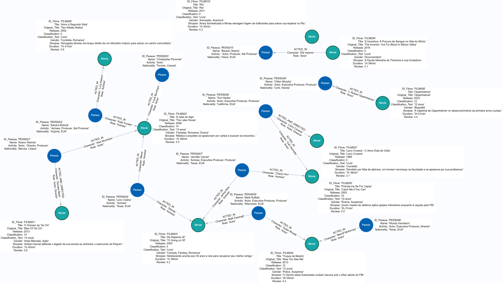
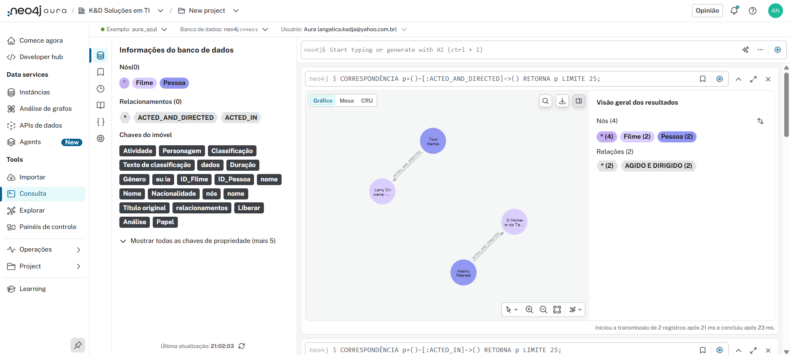
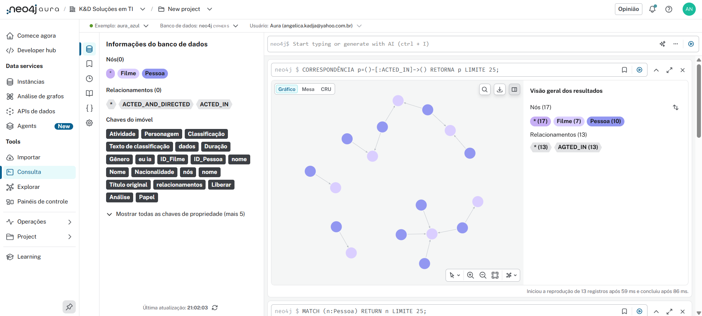
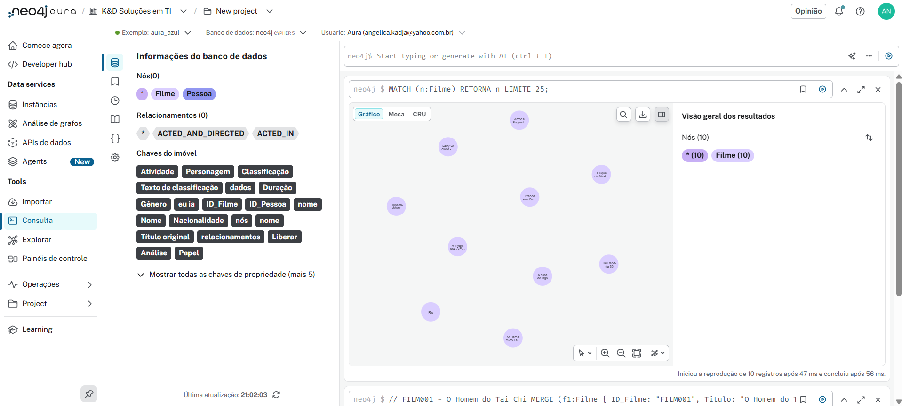
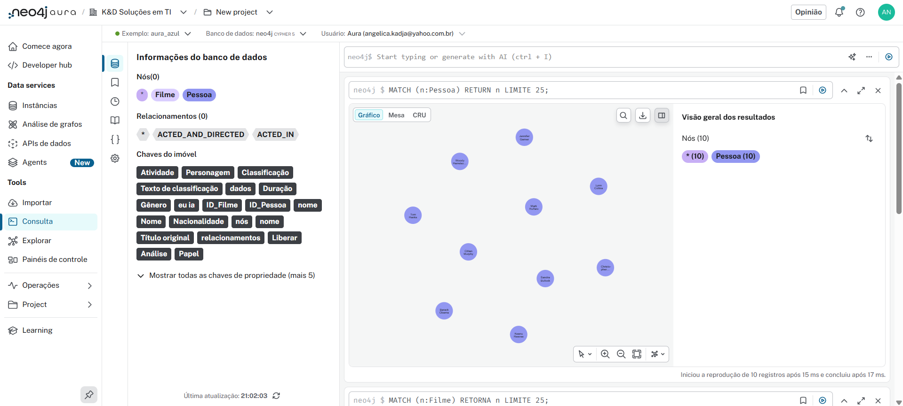

<p align="center">
  
</p>

<div align='center'>


<br/>

---

</div>

## 📒 Atividade proposta:

### 😵‍💫 Problema:
Você foi contratado por um novo serviço de streaming de filmes e séries e sua primeira tarefa é projetar o bando de dados. <br/>
Diferente dos sistemas tradicionais, a empresa quer focar nos relacionamentos para criar um sistema de recomendação poderoso. 
 
### 🎯 Desafio:
Modele e crie um pequeno grafo de conhecimento para este serviço. <br/>
O modelo deve incluir:
* Entidades (Nós):<br/>
User, Movie, Series, Genre, Actor, Director. 
* Conexões (Relacionamentos):<br/>
WATCHED (com propriedade rating), ACTED_IN, DIRECTED, IN_GENRE. 
 
### ⌛ Entrega: 
1. Diagrama ou esboço do seu modelo de grafos. <br/>
2. Um script Cypher (.cypher) que cria constraints para os nós (ex: UNIQUE para IDs) e popula o banco com pelo menos 10 usuários, 10 filmes/séries e seus respectivos relacionamentos. 

---

> ### 🚀 Resultado do meu projeto:



 <br/>

Foram criados: <br/>
- 20 nós
- 15 relacionamentos
- 170 propriedades
- 20 rótulos

---

> ### 🤔 Query utilizada:

```
// FILM001 - O Homem do Tai Chi
MERGE (f1:Filme {
  ID_Filme: "FILM001", Title: "O Homem do Tai Chi", Original_Title: "Man Of Tai Chi",
  Release: 2013, Classification: 14, Classification_Text: "14 anos",
  Gender: "Artes Marciais, Ação", Sinopse: "Artista marcial defende o legado de sua escola ao enfrentar o submundo de Pequim.",
  Duration: "1h 45min", Review: 3.6
})
MERGE (p1:Pessoa {
  ID_Pessoa: "PERS001", Name: "Keanu Reeves", Activity: "Actor, Director, Producer", Nationality: "Beirute, Líbano"
})
MERGE (p1)-[:ACTED_AND_DIRECTED {Character: "Donaka Mark", Role: "Actor, Director"}]->(f1)

// FILM002 - A Casa do Lago
MERGE (f2:Filme {
  ID_Filme: "FILM002", Title: "A casa do lago", Original_Title: "The Lake House",
  Release: 2006, Classification: 14, Classification_Text: "14 anos",
  Gender: "Fantasia, Romance, Drama", Sinopse: "Médica e arquiteto se apaixonam por cartas e buscam se encontrar..",
  Duration: "1h 39min", Review: 4.3
})
MERGE (p1)-[:ACTED_IN {Character: "Alex Burnham", Role: "Actor"}]->(f2)
MERGE (p2:Pessoa {ID_Pessoa: "PERS002", Name: "Sandra Bullock", Activity: "Actress, Producer, Set Producer", Nationality: "Virgínia, EUA"})
MERGE (p2)-[:ACTED_IN {Character: "Kate Forster", Role: "Actress"}]->(f2)
MERGE (p3:Pessoa {ID_Pessoa: "PERS003", Name: "Christopher Plummer", Activity: "Actor", Nationality: "Toronto, Canará"})
MERGE (p3)-[:ACTED_IN {Character: "Louis Burnham", Role: "Actor"}]->(f2)
MERGE (p4:Pessoa {ID_Pessoa: "PERS004", Name: "Lynn Collins", Activity: "Actress", Nationality: "Texas, EUA"})
MERGE (p4)-[:ACTED_IN {Character: "Mona", Role: "Actress"}]->(f2)

// FILM003 - De Repente 30
MERGE (f3:Filme {
  ID_Filme: "FILM003", Title: "De Repente 30", Original_Title: "13 Going on 30",
  Release: 2004, Classification: 0, Classification_Text: "Livre",
  Gender: "Comedy, Fantasy, Romance", Sinopse: "Adolescente acorda aos 30 anos e luta para recuperar seu melhor amigo.",
  Duration: "1h 38min", Review: 4.2
})
MERGE (p5:Pessoa {ID_Pessoa: "PERS005", Name: "Mark Ruffalo", Activity: "Actor, Executive Producer, Producer", Nationality: "Wisconsin, EUA"})
MERGE (p5)-[:ACTED_IN {Character: "Matt Flamhaff", Role: "Actor"}]->(f3)
MERGE (p7:Pessoa {ID_Pessoa: "PERS007", Name: "Jennifer Garner", Activity: "Actress, Executive Producer, Producer", Nationality: "Texas, EUA"})
MERGE (p7)-[:ACTED_IN {Character: "Jenna Rink", Role: "Actress"}]->(f3)

// FILM004 - Truque de Mestre
MERGE (f4:Filme {
  ID_Filme: "FILM004", Title: "Truque de Mestre", Original_Title: "Now You See Me",
  Release: 2013, Classification: 12, Classification_Text: "12 anos",
  Gender: "Police, Suspense", Sinopse: "Ilusionistas roubam bancos sob o olhar atento do FBI.",
  Duration: "2h 05min", Review: 4.4
})
MERGE (p5)-[:ACTED_IN {Character: "Dylan Rhode", Role: "Actor"}]->(f4)
MERGE (p6:Pessoa {ID_Pessoa: "PERS006", Name: "Woody Harrelson", Activity: "Actor, Executive Producer, Director", Nationality: "Texas, EUA"})
MERGE (p6)-[:ACTED_IN {Character: "Merritt McKinney", Role: "Actor"}]->(f4)

// FILM005 - Prenda-me Se For Capaz
MERGE (f5:Filme {
  ID_Filme: "FILM005", Title: "Prenda-me Se For Capaz", Original_Title: "Catch Me if You Can",
  Release: 2003, Classification: 10, Classification_Text: "10 anos",
  Gender: "Drama, Suspense", Sinopse: "Jovem mestre do disfarce aplica golpes milionários enquanto é caçado pelo FBI.",
  Duration: "2h 21min", Review: 4.5
})
MERGE (p7)-[:ACTED_IN {Character: "Cheryl Ann", Role: "Actress"}]->(f5)
MERGE (p8:Pessoa {ID_Pessoa: "PERS008", Name: "Tom Hanks", Activity: "Actor, Executive Producer, Producer", Nationality: "Califórnia, EUA"})
MERGE (p8)-[:ACTED_IN {Character: "Carl Hanratty", Role: "Actor"}]->(f5)

// FILM006 - Amor à Segunda Vista
MERGE (f6:Filme {
  ID_Filme: "FILM006", Title: "Amor à Segunda Vista", Original_Title: "Two Weeks Notice",
  Release: 2002, Classification: 0, Classification_Text: "Livre",
  Gender: "Comédia, Romance", Sinopse: "Advogada ativista vira braço direito de um bilionário imaturo para salvar um centro comunitário.",
  Duration: "1h 41min", Review: 3.9
})
MERGE (p2)-[:ACTED_IN {Character: "Lucy Kelson", Role: "Actress"}]->(f6)

// FILM007 - Larry Crowne
MERGE (f7:Filme {
  ID_Filme: "FILM007", Title: "Larry Crowne - O Amor Está de Volta", Original_Title: "Larry Crowne",
  Release: 1989, Classification: 0, Classification_Text: "Livre",
  Gender: "Comédia", Sinopse: "Demitido por falta de diploma, um homem recomeça na faculdade e se apaixona por sua professora.",
  Duration: "1h 39min", Review: 3.1
})
MERGE (p8)-[:ACTED_AND_DIRECTED {Character: "Larry Crowne", Role: "Actor, Director"}]->(f7)

// FILM008 - Oppenheimer
MERGE (f8:Filme {
  ID_Filme: "FILM008", Title: "Oppenheimer", Original_Title: "Oppenheimer",
  Release: 2023, Classification: 12, Classification_Text: "12 anos",
  Gender: "Biografia", Sinopse: "A trajetória de Oppenheimer no desenvolvimento da primeira arma nuclear.",
  Duration: "3h 01min", Review: 4.4
})
MERGE (p9:Pessoa {ID_Pessoa: "PERS009", Name: "Cillian Murphy", Activity: "Actor, Executive Producer, Producer", Nationality: "Cork, Irlanda"})
MERGE (p9)-[:ACTED_IN {Character: "J. Robert Oppenheimer", Role: "Actor"}]->(f8)

// FILM009 - A Inventora
MERGE (f9:Filme {
  ID_Filme: "FILM009", Title: "A Inventora: À Procura de Sangue no Vale do Silício", Original_Title: "The Inventor: Out For Blood In Silicon Valley",
  Release: 2019, Classification: 0, Classification_Text: "Livre",
  Gender: "Documentário", Sinopse: "A fraude bilionária da Theranos e sua fundadora.",
  Duration: "1h 59min", Review: 3.1
})
MERGE (p10:Pessoa {ID_Pessoa: "PERS010", Name: "Barack Obama", Activity: "Actor, Producer, Set Producer", Nationality: "Havaí, EUA"})
MERGE (p10)-[:ACTED_IN {Character: "Ele mesmo", Role: "Actor"}]->(f9)

// FILM010 - Rio
MERGE (f10:Filme {
  ID_Filme: "FILM010", Title: "Rio", Original_Title: "Rio",
  Release: 2011, Classification: 0, Classification_Text: "Livre",
  Gender: "Animação, Aventura", Sinopse: "Arara domesticada e fêmea selvagem fogem de traficantes para salvar sua espécie no Rio.",
  Duration: "1h 30min", Review: 4.3
})
```

---

> ### ✔️ Consultas básicas:

1. <b> Listar todos os filmes: </b>
```
MATCH (f:Filme)
RETURN f.Title AS Título, f.Release AS Ano, f.Review AS Avaliação
ORDER BY Ano;
```

2. <b> Listar todos os atores/atrizes: </b>
```
MATCH (p:Pessoa)
RETURN p.Name AS Nome, p.Activity AS Atividade, p.Nationality AS Nacionalidade
ORDER BY Nome;
```

3. <b> Mostrar quem atuou em cada filme: </b>
```
MATCH (p:Pessoa)-[r:ACTED_IN]->(f:Filme)
RETURN p.Name AS AtorAtriz, r.Character AS Personagem, f.Title AS Filme
ORDER BY Filme;
```

4. <b> Filmes dirigidos e atuados pela mesma pessoa: </b>
```
MATCH (p:Pessoa)-[r:ACTED_AND_DIRECTED]->(f:Filme)
RETURN p.Name AS Nome, f.Title AS Filme, r.Character AS Personagem;
```

5. <b> Buscar filmes por classificação indicativa: </b>
```
MATCH (f:Filme)
WHERE f.Classification >= 12
RETURN f.Title AS Filme, f.Classification AS Classificação;
```

6. <b> Top 5 filmes melhor avaliados: </b>
```
MATCH (f:Filme)
RETURN f.Title AS Filme, f.Review AS Avaliação
ORDER BY Avaliação DESC
LIMIT 5;
```

7. <b> Mostrar todos os filmes de um ator específico: </b>
```
MATCH (p:Pessoa {Name: "Sandra Bullock"})-[:ACTED_IN]->(f:Filme)
RETURN f.Title AS Filme, f.Release AS Ano;
```

8. <b> Relações completas (grafo visual): </b>
```
MATCH (p:Pessoa)-[r]->(f:Filme)
RETURN p, r, f;
```
---

> ### ✔️ Consultas no Neo4j Aura:

1. <b>Relacionamentos Atores e diretores</b>:<br/><br/>


2. <b>Relacionamentos Atores</b>:<br/><br/>


3. <b>Nós Filmes</b>:<br/><br/>


4. <b>Nós Pessoas</b>:<br/><br/>


---

> #### 🛠️ Ferramentas Utilizadas

- Neo4j Aura
- Microsoft Copilot 🤖
- Gemini 🤖
- VSCode

---

> #### 🔊 ACHTUNG

- Os projetos práticos que me ajudaram a aplicar esses conceitos na prática estão nessa pasta com todos os meus repositórios relacionados a trilha Neo4J - Análise de Dados com Grafos.
- Para visualizar os repositórios individualmente da trilha basta acessar cada pastinha dedicada ao projeto aqui da raíz.

---

<br/>
Feito com , até mais!

<div align="left">👧🏽 - ver mais em <a href="https://github.com/angelicakadja">AK</a>.</div>
