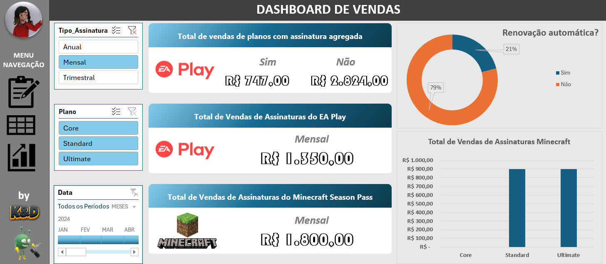

### <i> Criando um Dashboard de Vendas do Xbox com Excel </i>

 🏗️  

 

> #### 🎯 OBJETIVO DO PROJETO

- Criar um Dashboard de Vendas apenas com o Excel.

---

> #### 🛠️ FERRAMENTAS UTILIZADAS

- VSCode
- Git
- GitHub

---

> #### 🧩 DESCRIÇÃO DO DESAFIO

- A base veio limpa, não tive a necessidade de trabalhá-la, mas, como veio totalmente no idioma Inglês, converti todas as informações para o Português.
- Ocultei as guias da planilha de forma automatizada.
- Repliquei a tabela dinâmica para criar várias informações personalizadas.
- Apesar de não ter a necessidade, coloquei uma linha do tempo segmentada conectada para ilustrar mês a mês.
- Coloquei dois tipos de código em VBA:
  - Quando a planilha é aberta ela já inicializa em tela cheia e oculta cabeçalhos e barras de rolagem.
  - Quando o usuário vai encerrar a visualização e fechar o arquivo, ela volta ao estado original dela sem tela cheia.

---

> #### 🧰 RESULTADO DO PROJETO

  

---

> #### 🏆 Créditos

  - ver mais em <a href="https://github.com/angelicakadja">AK</a>.

