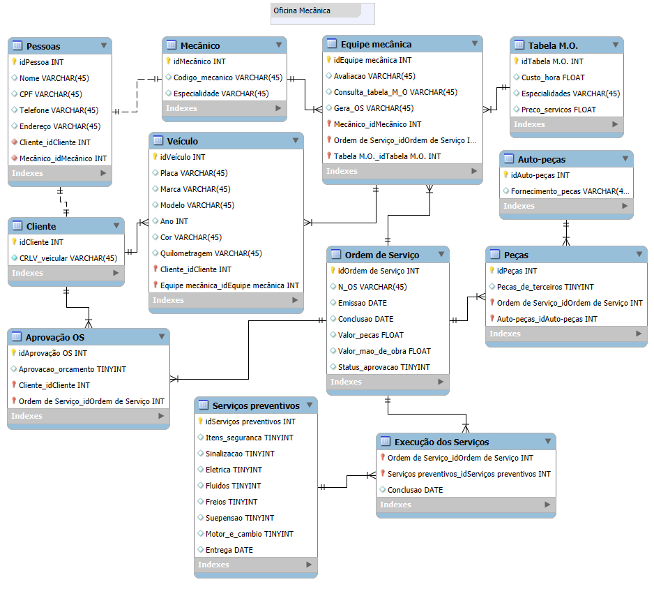

### <i> Construindo um Esquema Conceitual para Database, modelando do zero. </i>

 

 

> #### 🎯 OBJETIVO DO PROJETO

- Modelamos um contexto reduzido de uma oficina mecânica como um segundo desafio do bootcamp, curso Sistemas Relacionais em Banco de Dados da DIO, utilizando a ferramenta MySQL Workbench e os conceitos de primary key e foreign key, criando um esquema conceitual para o cenário proposto.

---

> #### 📝 NARRATIVA DO PROJETO

- Sistema de controle e gerenciamento de execução de ordens de serviço em uma oficina mecânica.
- Clientes levam veículos à oficina mecânica para serem consertados ou para passarem por revisões periódicas.
- Cada veículo é designado a uma equipe de mecânicos que identifica os serviços a serem executados e preenche uma OS com data de entrega.
- A partir da OS, calcula-se o valor de cada serviço, consultando-se uma tabela de referência de mão-de-obra.
- O valor de cada peça também irá compor a OSO cliente autoriza a execução dos serviços.
- A mesma equipe avalia e executa os serviços.
- Os mecânicos possuem código, nome, endereço e especialidade.
- Cada OS possui: n°, data de emissão, um valor, status e uma data para conclusão dos trabalhos.

---

> #### 🛠️ FERRAMENTAS UTILIZADAS

- MySQL Workbench
- VSCode
- Git
- GitHub

---

> #### 🧩 TIPO DE DESAFIO

- Full-Stack intermediário.

---

> #### ⚙️ MODELAGEM REALIZADA

- 👨🏽‍🔧 Oficina mecânica:
 

  
  &nbsp; &nbsp; 

 

---

> #### 🏆 Créditos

  - ver mais em <a href="https://github.com/angelicakadja">AK</a>.

