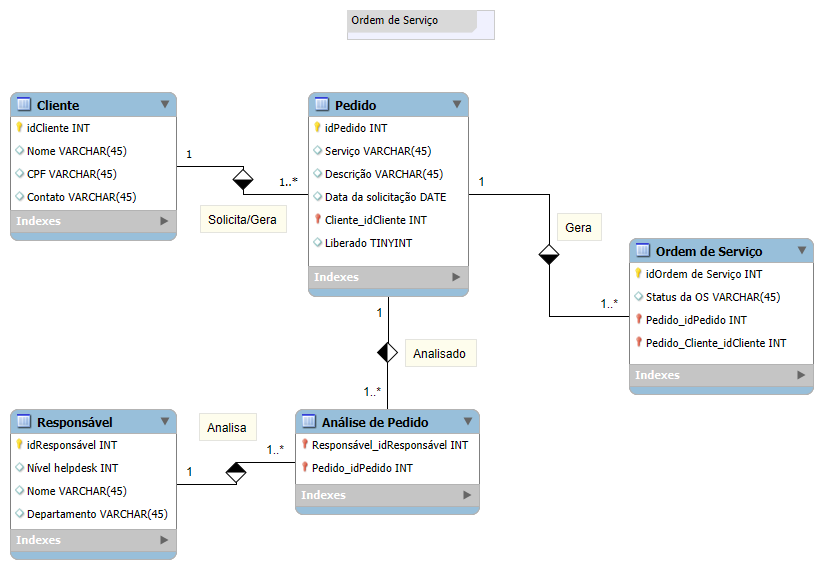
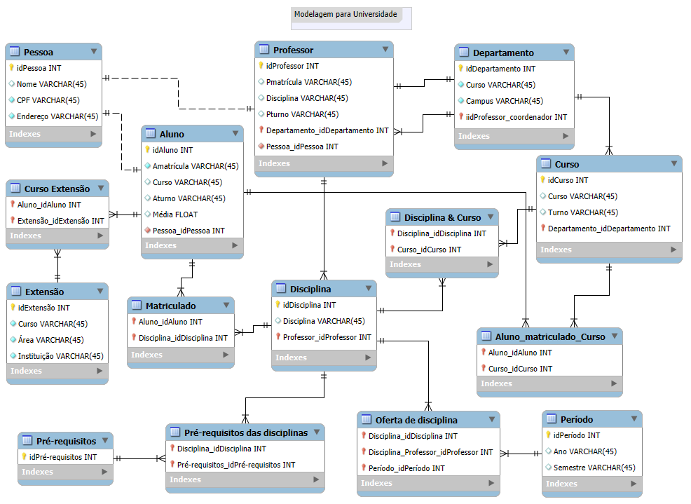
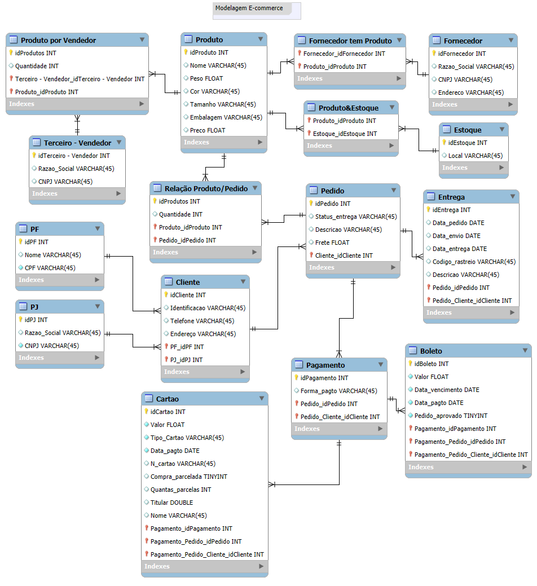

### <i> Construindo meu Primeiro Projeto de Banco de Dados. </i>

  

 

> #### 🎯 OBJETIVO DO PROJETO

- <b> Modelar um banco de dados para projeto com contexto reduzido de e-commerce. </b>
  - <strong style="color:#368986"> Primeira etapa do desenvolvimento. </strong>
    
  &nbsp; ▪ &nbsp;Contexto: levantamento de requisitos.

    
  &nbsp; ▪ &nbsp;Projeto Conceitual: Modelo ER.

  - <strong style="color:#368986"> Segunda etapa do desenvolvimento.</strong>
    
  &nbsp; ▪ &nbsp;Projeto Lógico: Modelo Relacional. 

---

> #### 📝 DESCRIÇÃO DO PROJETO

- Refinamento de um Projeto Conceitual de Banco de Dados – E-COMMERCE.
- O esquema deverá ser adicionado a um repositório do Github para futura avaliação do desafio de projeto
- Para este projeto, aplicamos os conceitos de modelagem de banco de dados vistos anteriormente na seção Bancos de Dados SQL e NoSql do bootcamp Heineken - Inteligência Artificial Aplicada a Dados com Copilot.
- Neste desafio, foi modelado junto da instrutora DIO banco para o contexto de Ordens de Serviço e de Universidade, já como desafio sozinha, fiz a modelagem para um E-commerce.

---

> #### 🛠️ FERRAMENTAS UTILIZADAS

- MySQL Workbench
- VSCode
- Git
- GitHub

---

> #### 🧩 TIPO DE DESAFIO

- Full-Stack intermediário.

---

> #### ⚙️ MODELAGENS REALIZADAS

- 👨🏽‍🔧 Ordem de serviço:
 

  
  &nbsp; &nbsp; 

 

- 🏫 Universidade:
 

  
  &nbsp; &nbsp; 

 

- 🛍️ E-commerce:
 

  
  &nbsp; &nbsp; 

 

---

> #### 🤹🏽‍♀️ O QUE FOI ACRESCENTADO A MODELAGEM E-COMMERCE

- <b>Cliente PJ e PF </b> - Uma conta pode ser PJ ou PF, mas não pode ter as duas informações: Como os requisitos não informam se deve haver alguma característica particular ao cliente se ele for PJ ou PF, adicionei um atributo chamado Identificação para a entidade Cliente para informar se o cliente é PF ou PJ.

- <b>Pagamento </b> – Pode existir mais de uma forma de pagamento, criei nova entidade chamada Pagamento, que contém atributos relacionados ao tipo de cartão se crédito ou débito e boleto, além de que, os dados de cartões podem ser persistidos.

- <b>Entrega </b> – Possui vários atributos com todos os dados principais da entrega como data do pedido, da entrega e do envio, além de status e código de rastreamento.

> #### 🏆 Créditos

  - ver mais em <a href="https://github.com/angelicakadja">AK</a>.

